# gitlab 시연 시나리오

### 초기 화면

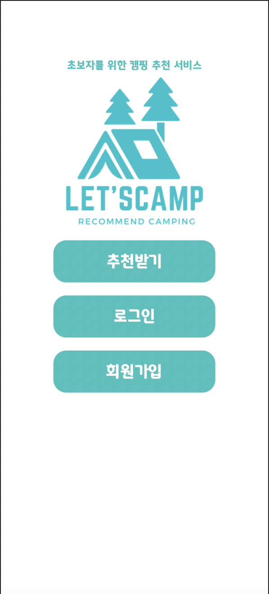

- Let’s Camp의 첫 얼굴입니다. 비회원으로 캠핑장을 추천받을 수 있습니다.
- 회원가입 / 로그인 페이지로 이동이 가능합니다.

---

### 비회원 추천

1. 동반 유형 입력
   
    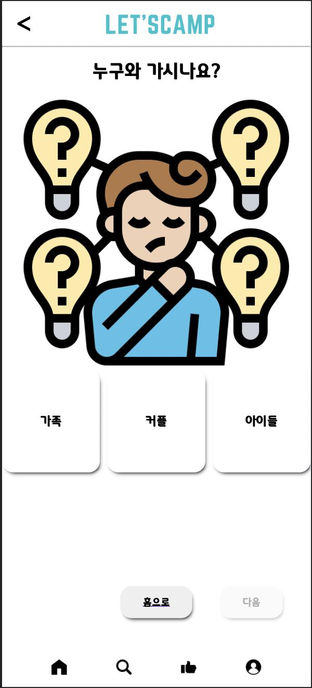
    
    - 캠핑장에 같이 갈 동반 유형을 선택합니다.
    - 가족 / 커플 / 아이들과 함께 가는 유형 중 하나를 선택합니다.
2. 반려동물 동반 유무
   
    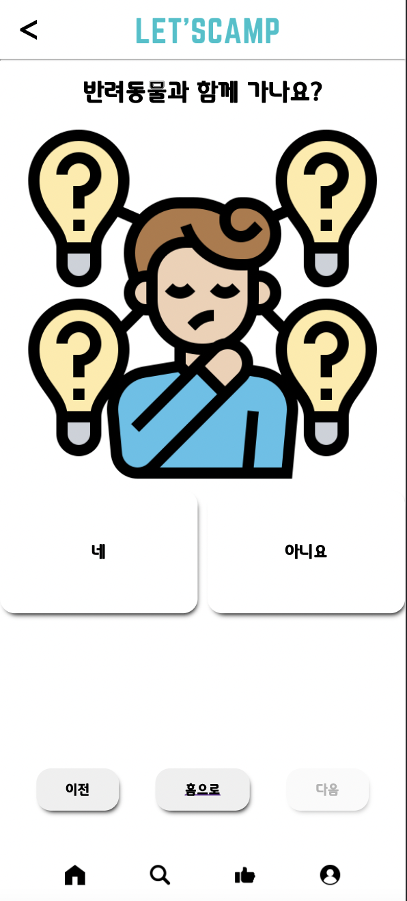
    
    - 반려동물과 동반하는 지 여부를 입력합니다.
3. 선호하는 장소 입력
   
    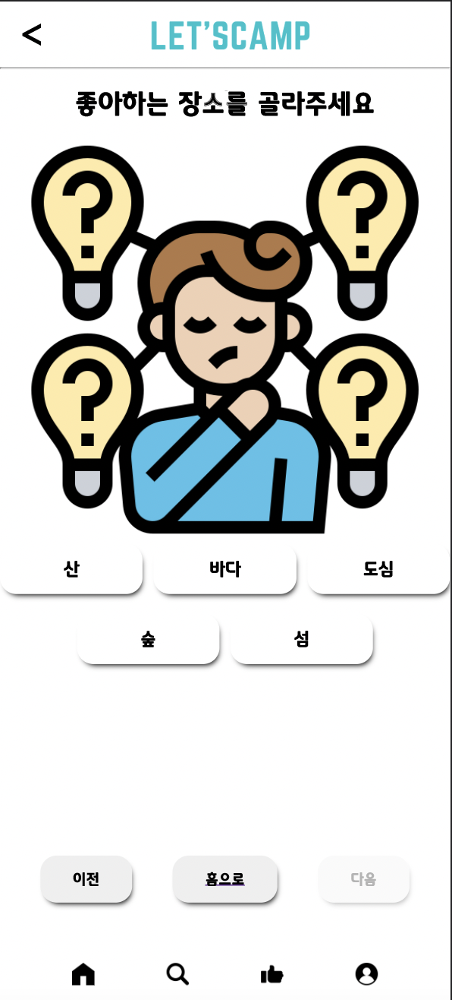
    
    - 자신이 선호하는 장소 유형을 선택합니다.
    - 산 / 바다 / 도심 / 숲 / 섬 중 하나를 선택합니다.
4. 선호하는 캠핑 유형 입력
   
    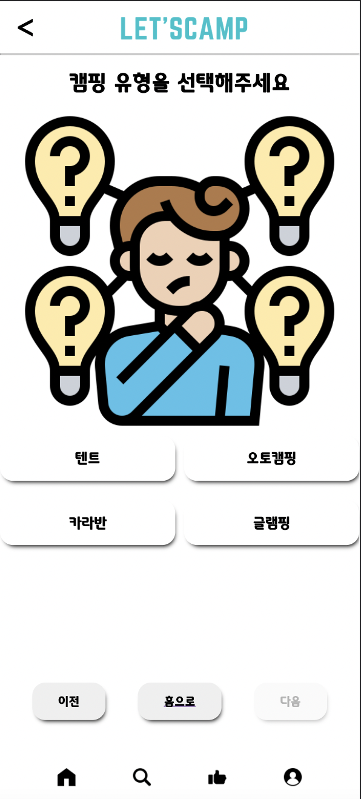
    
    - 선호하는 캠핑 유형을 선택합니다.
    - 텐트 / 오토캠핑 / 카라반 / 글램핑 중 하나를 선택합니다.
5. 가려고 하는 날짜 입력
   
    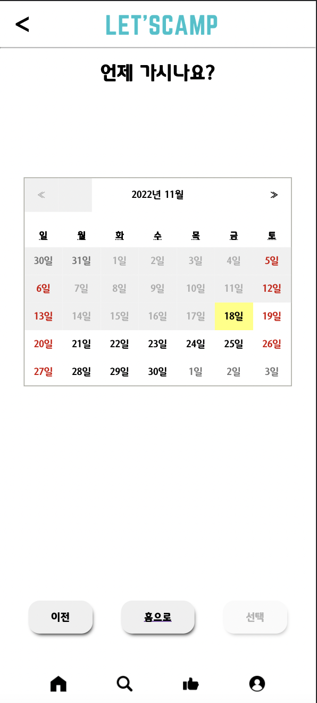
    
    - 캠핑을 가려고하는 날짜를 입력합니다.
    - 현재 날짜 기준 월의 달력이 나오고 화살표 버튼을 통해 이후의 날짜도 선택이 가능합니다.
6. 입력된 날짜의 계절에 맞는 테마 중 선택
   
    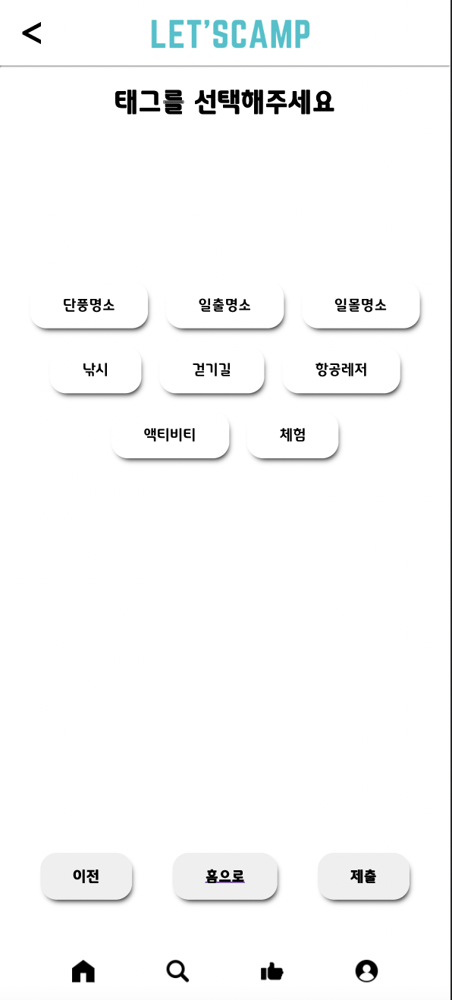
    
    - 앞서 입력한 날짜의 계절을 분석하여 계절에 맞는 테마들을 띄워줍니다.
    - 그 중 사용자가 선호하는 캠핑 테마를 선택합니다.
7. 추천 결과
   
    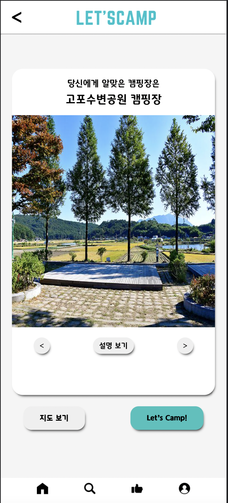
    
    - 위의 입력된 내용을 바탕으로 가장 사용자의 선호에 맞는 캠핑장 리스트를 출력합니다.
    - 리스트를 넘겨볼 수 있고 해당하는 캠핑장의 위치를 지도 보기 버튼을 통하여 지도로 확인합니다.
    - 비회원이므로 Let’s Camp 버튼을 누르면 회원가입 / 로그인을 해야한다고 Alert 창이 나타납니다.

---

### 회원가입 / 로그인

1. 회원가입
   
    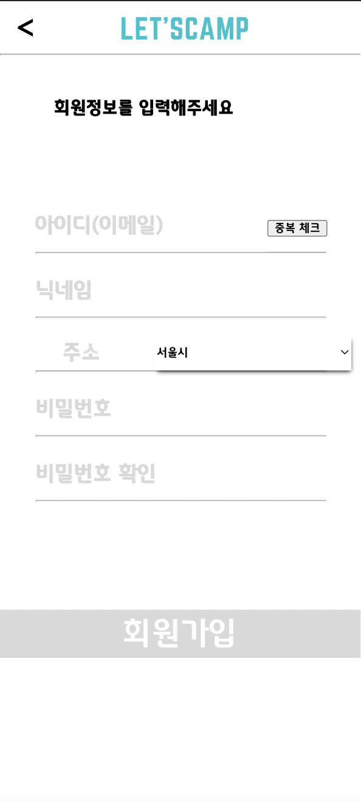
    
    - 아이디를 입력받습니다. 중복체크를 통과한 아이디만 가능합니다.
    - 닉네임을 입력받습니다.
    - 대한민국 광역자치단체 중 하나를 선택하여 주소를 입력받습니다.
    - 비밀번호를 입력받고 비밀번호 확인을 통하여 유효성을 검사합니다.
2. 로그인
   
    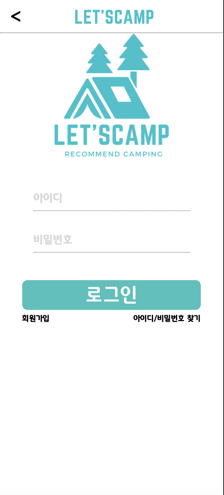
    
    - 등록된 아이디 / 비밀번호를 입력하여 로그인합니다.
    - 가입되지 않은 경우 회원가입 버튼을 눌러 회원가입 창으로 이동할 수 있습니다.
    - 아이디/비밀번호를 잊어버린 경우 아이디/비밀번호 찾기 버튼을 통해 아이디/비밀번호를 찾을 수 있습니다.

---

### 회원 추천

1. 회원 로그인 후 추천 페이지 이동
   
    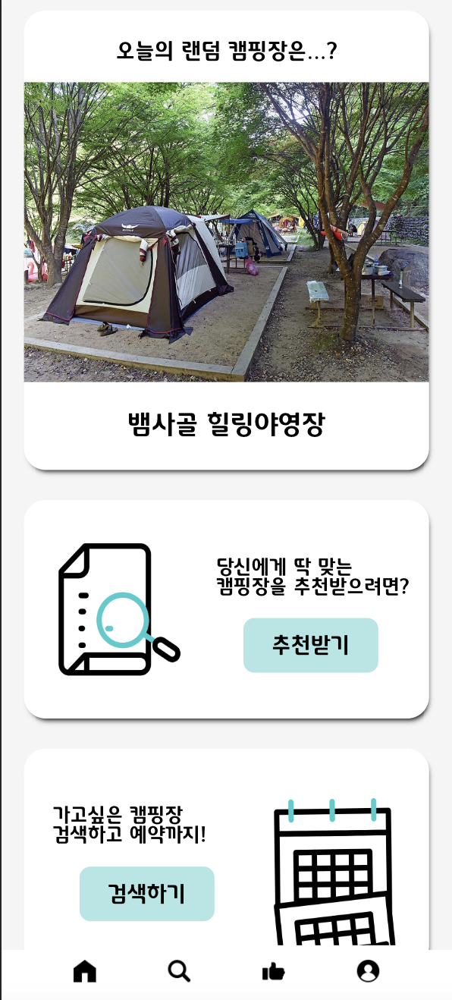
    
    - 로그인 후 메인페이지에서 추천받기 버튼을 클릭하여 추천 페이지로 이동합니다. (이후 비회원추천과 같음)
    - 로그인 후 하단 Nav바의 엄지 버튼을 클릭하여 추천 페이지로 이동합니다. (이후 비회원추천과 같음)
2. 추천 결과
   
    
    
    - 회원이므로 Let’s Camp! 버튼 클릭 시 해당하는 캠핑장을 예약할 수 있는 캠핑장 예약 페이지로 이동합니다.

---

### 추천받은 캠핑장 예약

1. 예약 페이지
   
    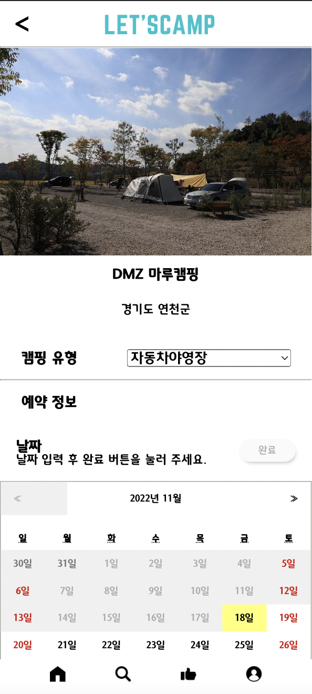
    
    - 해당하는 캠핑장의 유형 중 자신이 추천 당시 입력했던 유형으로 기본 설정이 되어있고 캠핑 유형을 선택합니다.
    - 날짜를 선택하고 완료버튼을 클릭합니다.
    
    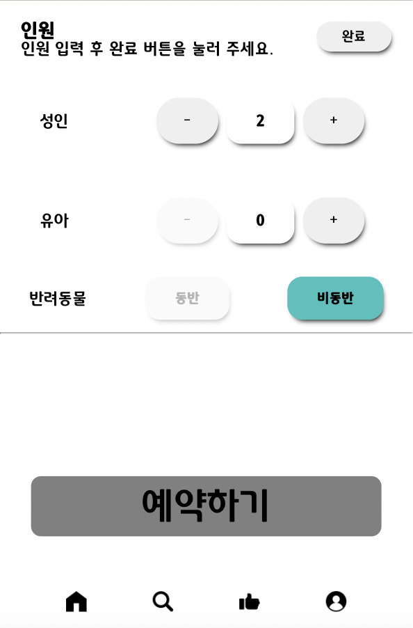
    
    - 성인 / 유아 인원을 설정합니다.
    - 반려동물 동반 유무 또한 추천 입력 당시의 데이터가 기본으로 설정되어 있습니다.
    - 선택을 완료한 후 예약합니다.
2. 예약 완료 후 메인 페이지
   
    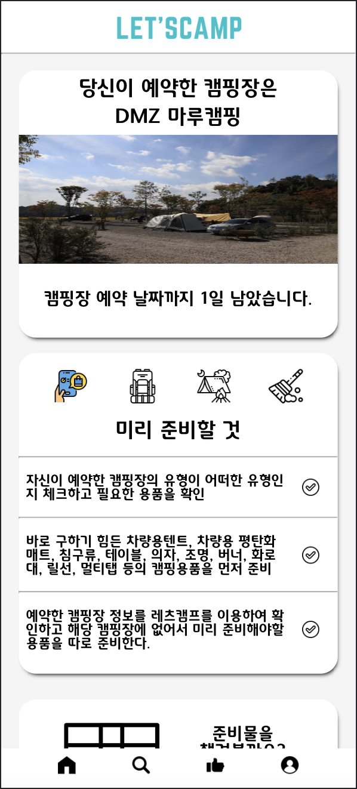
    
    - 예약이 완료된 후 메인페이지에서 예약한 캠핑장 정보와 예약한 날짜까지의 일수를 확인할 수 있습니다.

---

### 캠핑장 검색

1. 검색 페이지 이동
   
    
    
    - 메인 페이지의 검색하기 버튼 혹은 하단 Nav바의 돋보기 버튼을 클릭하여 검색 페이지로 이동합니다.
2. 검색 페이지
   
    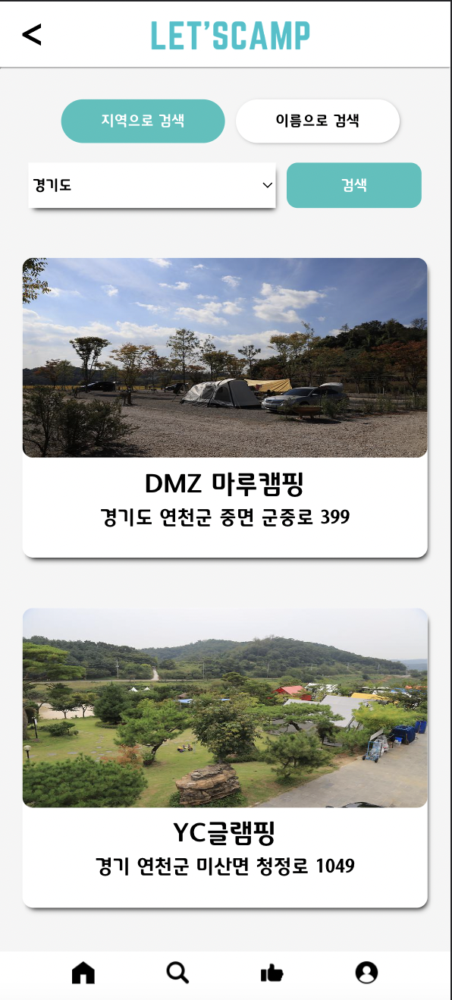
    
    - 초기 화면엔 가입 당시 입력한 회원의 주소 정보를 바탕으로 해당하는 광역자치단체 내의 캠핑장을 출력합니다.
    - 해당 하는 캠핑장을 클릭할 경우 해당 캠핑장의 상세 정보 페이지로 이동합니다.
3. 지역 검색
   
    
    
    - 지역 검색의 DropDown 바를 통해 광역자치단체를 선택하여 검색할 수 있습니다.
4. 이름 검색
   
    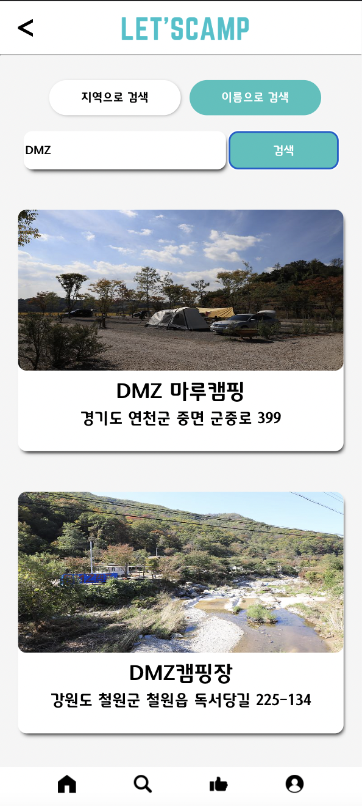
    
    - 이름으로 검색 버튼을 통해 이름으로 검색할 수 있습니다.
    - 입력 칸에 이름을 입력하고 검색을 클릭하면 해당하는 이름을 포함하고 있는 캠핑장 리스트를 출력합니다.

---

### 예약 없는 메인

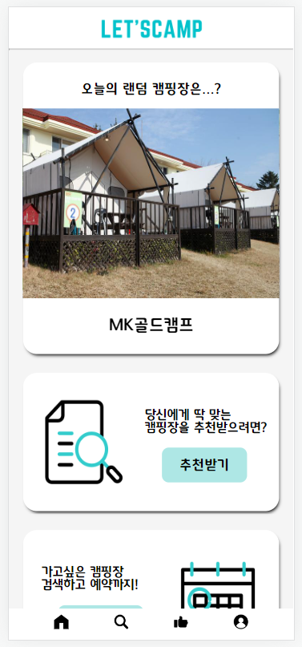

- 예약이 없는 회원의 메인 페이지입니다.
- 상단에는 캠핑장 정보를 랜덤으로 볼 수 있습니다.
- 캠핑장 정보 하단에는 회원의 선호에 맞는 캠핑장을 추천 받을 수 있는 페이지로 이동하는 버튼이 있습니다.
- 추천 받기 하단에는 캠핑자을 검색해서 캠핑장의 정보를 확인할 수 있는 페이지로 이동하는 버튼이 있습니다.

### 예약 일정 관리

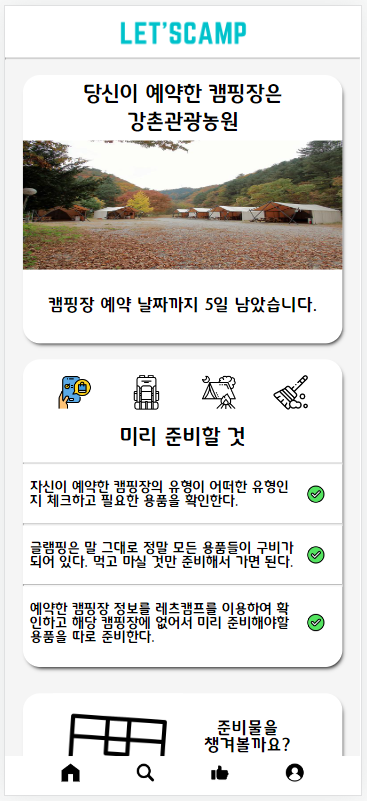

- 예약한 회원의 메인 페이지입니다.
- 상단에는 회원이 예약한 캠핑장 이름과 예약 시작날까지 몇일 남았는지 예약 정보를 확인할 수 있습니다.
- 예약 정보 하단에는 현재 해야할 캠핑 일정이 있습니다.
- 미리 준비할 것
  
    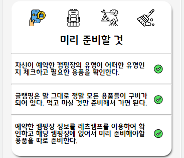
    
    - 현재는 예약 시작 날짜 전이기 때문에 ‘미리 준비할 것’ 일정을 확인할 수 있습니다.
- 출발 직전 준비
  
    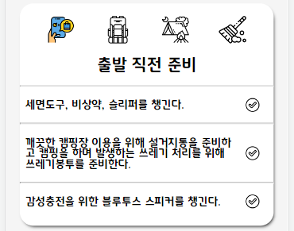
    
    - 현재는 예약 시작 날짜 오후 1시 이전이기 때문에 ‘출발 직전 준비’ 일정을 확인할 수 있습니다.
- 캠핑 도착 이후
  
    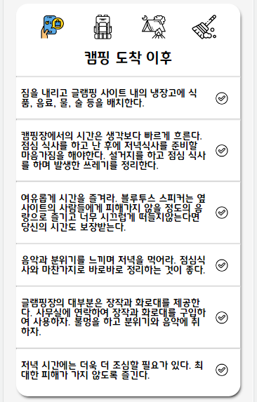
    
    - 현재는 예약 시작 날짜 오후 1시 이후이기 때문에 ‘출발 직전 준비’ 일정을 확인할 수 있습니다.
- 캠핑 마무리
  
    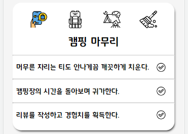
    
    - 현재는 예약 마지막 날짜이기 때문에 ‘캠핑 마무리’ 일정을 확인할 수 있습니다.

### 준비물 페이지

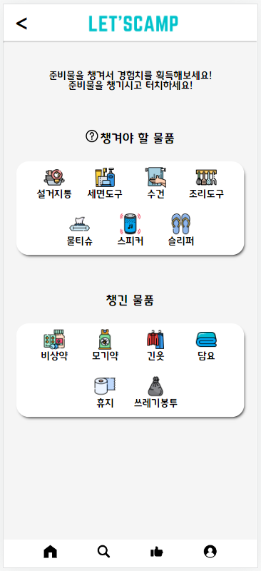

- 캠핑장으로 출발하기 전에 챙겨야 할 준비물을 확인할 수 있는 페이지입니다.
- 챙겨야 할 물건들을 챙긴 후 해당 아이콘을 클릭해서 챙긴 물품으로 옮길 수 있습니다.

---

### 분리수거 페이지

- 분리수거 페이지에서는 쓰레기 사진을 업로드하면 경험치를 받을 수 있습니다.
- 분석하기 버튼을 누르면 사진이 제출됨과 동시에 어떤 쓰레기인지 분석하는 기능을 제공해줍니다.

### 캠핑장 상세 페이지

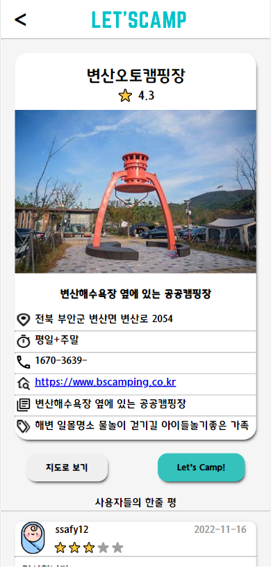

- 캠핑장 상세 페이지를 볼 수 있습니다.
- 캠핑장 이름, 별점, 사진, 설명, 위치, 운영 요일, 전화번호, 홈페이지, 간단한 설명, 태그 등을 알 수 있습니다.
- 예약 페이지로 간단히 넘어 갈 수도 있고 지도로 보기 버튼을 통해 지도에서 위치를 볼 수 있습니다.
- 아래에는 사용자들이 남긴 별점과 리뷰를 확인할 수 있습니다.

### 캠핑장 지도 페이지

- 캠핑장의 위치 마커와 캠핑장 이름으로 볼 수 있습니다.

### 마이 페이지

- 마이 페이지에서는 이용자 등급에 따른 캐릭터, 경험치, 아이디, 닉네임, 주소를 확인할 수 있습니다.
- 회원정보 수정을 누르게 되면 사용자의 닉네임, 주소, 비밀번호를 변경할 수 있습니다.
- 로그아웃 버튼을 누르면 로그 아웃이 되고 시작 페이지로 이동합니다.
- 아래에는 그동안 다녔던 캠핑장의 리뷰를 볼 수 있습니다.